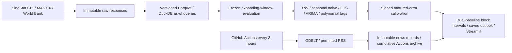

# Singapore cooking-oil price outlook

Local research slice: SingStat Vegetable Oils CPI, World Bank palm/soy benchmarks and MAS USD/SGD. **Random walk is the primary benchmark.** Historical results are reconstructed diagnostics, not authenticated vintage backtests. Prospective inputs retain actual retrieval timestamps.

[Generated v2 results](docs/slice_v2_results.md) · [Methodology](docs/slice_v2_methodology.md) · [Sources](docs/sources.md) · [Original plan](docs/phase1_plan.md) · [Research-agent plan](docs/research_agent_plan.md)

The research agent is **planned only**. No additional goods or paid APIs are implemented.

## Setup and commands

Python **3.12+** is required in the package, lockfile environment and launcher. The exact lock was clean-installed and tested on Python 3.12.14. Tests use synthetic data/mocks and reject network connections; the dashboard test runs without pre-existing data or artifacts.

```sh
python3.12 -m venv .venv
.venv/bin/python -m pip install -r requirements.lock
./run.sh                           # Online ingestion, news, evaluation, then local dashboard
./run.sh run --refresh              # Online refresh and saved forecasts
./run.sh run --no-news              # Reproduce from saved structured/news snapshots, offline
./run.sh dashboard --port 8501      # http://127.0.0.1:8501
PYTHONPATH=src .venv/bin/python -m pytest -q
.venv/bin/python -m ruff check src tests
```

`run.sh` sets `PYTHONPATH=src`. A clean clone needs an initial online run. Saved data and artifacts are intentionally excluded from Git, as are `.env` and `.venv/`. Refresh failures stop mandatory structured ingestion; optional feed failures remain visible. The page reads saved artifacts and never silently retrains.

## Architecture



Changes reuse the existing connectors, store, evaluation and reporting modules. The additional archive module transfers and verifies the existing news store; it does not duplicate ingestion.

## Evaluation contract

- CPI history begins January 2015. Initial training ends December 2019; expanding origins run January 2020–January 2026. Development has 37 origins; the reused audit has 36. The v2 changes were motivated by v1 findings, so the audit is **diagnostic, not a fresh untouched holdout**.
- `artifacts/protocols/slice_v2.json` freezes configuration, source snapshot and training-only direction bands. The original `artifacts/protocol.json` and v1 runs remain unchanged. A changed config requires a separately named experiment; do not erase a protocol to improve scores.
- Forecast targets are issuance month +1/+3/+6. Labels also show months beyond the latest observed CPI. A publication bridge can make the model distance longer. Corrections are never borrowed across different effective distances.
- Random walk and seasonal naive are both scored. Paired MAE reductions, MASE skill, directional accuracy and 95% circular block-bootstrap intervals use identical forecast origins. MASE uses each origin's training seasonal scale; a MASE below one alone is not evidence of improvement.
- Model selection uses development MAE skill versus RW. Equal point scores use development interval score to choose uncertainty; audit labels never choose a model. Any horizon model switching is explicitly labelled on the fan chart.
- Two-sided log-space conformal corrections can shrink or expand ranges, using only matured out-of-sample scores (minimum 24, last 60). Median-preserving noncrossing clamps are logged. Time-series exchangeability is not assumed.
- Full-history and trailing-36-month base uncertainty variants are both evaluated. Before/after comparisons keep the point model and origin fixed; details, interval scores and seasonal-naive width changes are in the generated report.
- Separate palm/soy drivers have constrained quadratic lag profiles over months 0–12. One specification converts both to SGD and omits an extra FX regressor; the other uses separate USD prices plus FX. No 50/50 basket is imposed. Asymmetry and cointegration diagnostics are supporting evidence only.
- News is excluded from historical predictive features. LLM API spend is zero; the development ceiling is USD 50/month, paid backfill disabled. Human labelling is **planned**, not completed.

## Historical versus prospective availability

For verified prospective queries, `available_at` equals actual retrieval time; new versions never rewrite earlier as-of queries. Historical replay requires a frozen snapshot and a separate assumed release clock: CPI on next-month day 28, benchmarks/FX on day 15, both at 23:59:59 Singapore time. Those dates are unverified assumptions and current source histories can contain revisions. Publication lags do not make reconstructed values authentic historical vintages.

The tests establish implemented cutoff behavior, including future-data mutation, ECM estimation, known versus unknown lag-zero inputs, immature calibration residuals and archive timestamp preservation. They cannot prove that unavailable historical vintages were unchanged. Verified-PIT outcome scores remain unavailable until future targets mature.

## News scheduling and persistence

[Collector workflow](.github/workflows/collect-news.yml) runs at minute 17 every three hours UTC, independently of a local Codex session. It needs only Python's standard library and the repository's automatic GitHub token. Each run restores the previous cumulative archive, appends actual retrievals and uploads `news-archive` as an Actions artifact. The latest eight complete backups are retained, each with 90-day expiry; superseded copies are pruned only after the new upload is confirmed. Individual records are immutable and checksummed.

This is not an always-on SLA: GitHub can delay/drop schedules and disable inactive public-repository schedules. A prolonged outage/expiry or storage quota can lose hosted history; export backups periodically. The cloud archive begins at deployment; earlier local records remain in the original local archive. No timestamps are backdated to close gaps. Source success and occupied schedule slots are measured separately from keyword-relevant story counts.

```sh
./run.sh collect-news
./run.sh extract-news
./run.sh annotations
PYTHONPATH=src .venv/bin/python -m retail_outlook.news_archive pack --root .
gh workflow run collect-news.yml
PYTHONPATH=src .venv/bin/python -m retail_outlook.news_archive restore-latest --root .
```

Restore merges only identical or previously absent immutable files and rejects conflicts. It requires an authenticated `gh` CLI locally. See [news operating notes](docs/news.md) for rights, limits, backoff and annotation procedures.

## Artifacts and limitations

`artifacts/runs/<run_id>/` stores model numbers, forecast samples' scores, paired effects, interval comparisons, pass-through estimates, graph edges, history, source/code/config checksums, fan PNG and deterministic outlook. `artifacts/latest.json` selects the page's run. The report's citations link to inputs and articles; no unsupported news narrative is generated.

The sample is small, price drivers are correlated and retail recipes/contracts are not observed. Polynomial constraints reduce parameter count but can impose the wrong lag shape. Bootstrap intervals are conditional on the specification. No causal identification, news validation, prospective calibration success, or multi-good acceptance claim is asserted. Electricity remains outside any food denominator. Model deficiencies are reported rather than tuned away after viewing audit results.
