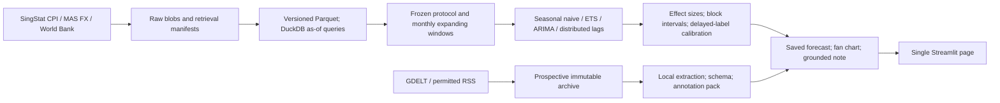

# Singapore Retail Price Outlook — cooking-oil slice

A local research pipeline for **SingStat Vegetable Oils CPI**, using World Bank palm/soy prices and MAS USD/SGD. The cooking-oil vertical slice is implemented; broader goods, advanced ensembles and full news validation are deferred until review.

Historical performance is **reconstructed**, not a verified historical-vintage backtest. Every new source retrieval and article version keeps its actual availability timestamp. Prospective outcome evaluation is not yet possible because future targets have not matured.

Plans: [approved slice plan](docs/phase1_plan.md) · [research agent roadmap (not implemented)](docs/research_agent_plan.md).

## Run

Tested on macOS ARM with Python **3.12.14**. Python 3.12+ is required everywhere; the supplied exact dependency lock is tested on 3.12. No paid API keys are needed.

```bash
python3.12 -m venv .venv
.venv/bin/python -m pip install -r requirements.lock
./run.sh
```

The last command retrieves the three structured sources, collects permitted news, runs the frozen evaluation, saves a current forecast and starts Streamlit at **http://127.0.0.1:8501**. Open that address locally. Use `./run.sh run --refresh --open` explicitly for the same behavior. Keep source snapshots and the evaluation protocol to reproduce historical results.

```bash
./run.sh run --no-news          # Rebuild using saved data; no network collection
./run.sh run --refresh          # Refresh data and artifacts without starting a second server
./run.sh dashboard              # Display saved artifacts, no retraining
./run.sh collect-news           # One prospective collection pass
./run.sh extract-news           # Local rules only; unvalidated
./run.sh annotations            # Blank story-separated labelling pack; fails readiness until enough stories
PYTHONPATH=src .venv/bin/python -m pytest -q
.venv/bin/python -m ruff check src tests
```

`PYTHONPATH=src` is deliberately set by `run.sh`; it also works on runtimes that do not process editable-install `.pth` files. No package install is needed beyond the dependencies. Run commands from this project directory. Stop the server with Ctrl-C in its terminal. Refresh the page after a new pipeline run.

The first source snapshot and generated artifacts are already present in this workspace. They are ignored by Git. A clean clone requires the first online run; subsequent saved-data runs are reproducible offline. If a mandatory source fails on refresh, the pipeline stops rather than silently using it as fresh data. Optional news failures are recorded while other feeds continue.

## What the slice contains



- The local page shows actual CPI history, three horizon forecasts, effect-size intervals, all baseline results, pass-through estimates, news coverage and downloads.
- Original source bytes and retrieval manifests are immutable. Normalized snapshots are checksummed Parquet files queried using DuckDB.
- Snapshot IDs, config, code hashes, dependency-lock hashes, seeds, input evidence and output checksums are stored per run.
- Local extraction and deterministic outlook prose incur **$0 LLM API cost**. USD50/month is the development ceiling; paid providers are not implemented/enabled. Paid historical backfill cannot be enabled before human validation.
- Electricity is a driver only. The future food catalogue currently has 11 CPI targets plus experimental onions. No 8-of-12 success claim is made for a one-good slice.

## Data and permissions

| Source | Series / unit | Access / rights notes |
|---|---|---|
| [SingStat M213751](https://tablebuilder.singstat.gov.sg/table/TS/M213751) | `1.01.5.1` Vegetable Oils, 2024=100 | Official JSON API; [SingStat terms](https://www.singstat.gov.sg/terms-of-use). Retain attribution and source notices. |
| [MAS through SingStat M700051](https://tablebuilder.singstat.gov.sg/table/TS/M700051) | `1` US Dollar, SGD per USD | Official MAS-sourced table; not an executable FX quote. Preserve underlying provider provenance; unrestricted redistribution is not asserted. |
| [World Bank Pink Sheet](https://www.worldbank.org/en/research/commodity-markets) | Palm oil and soybean oil, USD/metric tonne | Workbook discovered from the official landing page; [terms](https://data.worldbank.org/summary-terms-of-use), including dataset-specific exceptions. |
| [GDELT](https://gdeltproject.org/data.html) | Relevant article metadata and URLs | No commercial article-body scraping; API errors/rate limits are visible, not an empty-news signal. |
| [SFA RSS](https://www.sfa.gov.sg/news-publications/newsroom/subscribe-to-sfa-rss-feeds), [FAO RSS](https://www.fao.org/feeds/fao-newsroom-rss), [USDA ARS](https://www.ars.usda.gov/news-events/rss-feeds/) | Supplied feed titles/descriptions and links | Personal research use of supplied feed content; no inference of rights over linked commercial pages. Full details in [news source notes](docs/news.md). |

Structured observations retrieved on 17 September 2026: CPI January 2015–July 2026 (139 months); palm/soy January 1960–August 2026 (800 each); FX January 1988–August 2026 (464). Longer driver histories do not create older target history.

Paid futures, paid publisher text, FAO/FRED/USDA structured connectors and historical article backfill are outside this slice. NASS RSS is disabled after HTTP403. Some direct MAS terms/services were unavailable during source research; the implementation uses the published SingStat route for personal research and does not redistribute the underlying datasets. Check rights before any future public deployment.

## Time semantics

`available_at` for prospective queries is the actual retrieval time. Revised values append a new snapshot; earlier as-of queries retain the earlier version. Historical reconstructed queries require an explicit frozen snapshot and filter on a separate `assumed_available_at`.

Historical assumptions, all **unverified**: CPI becomes available at 23:59:59 Singapore time on day28 of the following month; World Bank and monthly FX on day15. These are conservative operational assumptions, not authenticated release calendars. A table refreshed today can contain later revisions and retrospectively published detail. Applying a lag does not remove this limitation.

Forecast horizons refer to issuance calendar month plus 1, 3 or 6. January issuance normally uses December CPI, hence effective model distances of 2, 4 and 7 months. A forecast issued before the next CPI release can have a longer bridge. Its native intervals are shown without silently borrowing conformal corrections from a different effective distance.

## Frozen evaluation

- Initial training: January 2015–December 2019. Monthly expanding origins: January 2020–January 2026, common across all three horizons (73 origins). Longer recent one-month history is excluded from the matched panel.
- Development: first37 origins. Final audit: February2023–January2026 (36 origins). Candidate specifications were fixed before audit results were inspected. Model selection per horizon uses development MASE only.
- Frozen unchanged bands: **±1.1625%, ±1.3856%, ±1.3328%** at 1/3/6 months, from half the initial-training standard deviation of cumulative log changes over the effective horizon, floor0.1pp. These are statistical research bands, not asserted consumer materiality thresholds. Multi-month volatility need not increase monotonically.
- Primary effect: paired MAE reduction in CPI points with 95% circular moving-block bootstrap intervals, 12-month blocks and1,000 draws. Also report MASE skill, MAPE/sMAPE, directional accuracy, pinball, empirical-sample CRPS, coverage, width and interval score.
- MASE uses each origin's training seasonal scale. A win compares candidate and seasonal-naive MASE on identical origins; MASE<1 alone is not a win.
- Conformal expansion uses only previously issued raw out-of-sample interval scores whose target has been released under the reconstruction assumptions, at least24 and at most60 matured scores. The correction is finite-sample, expansion-only and evaluated as an empirical time-series procedure; no exchangeability guarantee is claimed.
- No historical news feature is used. No random cross-validation, future exogenous prices, future labels, backward imputation or full-sample preprocessing is used.

`artifacts/protocol.json` is created once before evaluation. Subsequent configuration changes fail rather than silently redefine that experiment. Keep it with its frozen source snapshot. For a later experiment, copy the project/config into a separately named experiment directory and document the change; do not delete the original protocol to improve a reported score.

## Model assumptions and present findings

Seasonal naive preserves the previous year's same-month value. ETS is a damped additive trend on log CPI, without fitted seasonality. ARIMA is fixed(1,1,1) on log CPI. Non-convergent ARIMA fits explicitly fall back to random walk; the audit includes3 such origins out of36. Model uncertainty uses historical innovations/native predictive variance, with fixed parameters; the error calibration is assessed separately.

The distributed-lag candidate uses retail log-change persistence plus three lags each of an equal-weight geometric palm/soy USD basket and SGD/USD. That basket is a modelling assumption, not Singapore's measured retail oil recipe. Future driver changes are joint block-bootstrap innovations centered on persistence; already-retrieved drivers beyond the latest CPI are used where known. Coefficient/scenario uncertainty is estimated separately with block resampling.

First frozen audit, selected models:

| Horizon | Development-selected model | MAE reduction vs seasonal naive | 95% block interval | MASE skill | 80% coverage |
|---|---|---:|---|---:|---:|
| 1m | ETS | +1.197 CPI pts | +0.210 to +2.480 | +42.1% | 88.9% |
| 3m | ARIMA with failure fallback | +0.700 CPI pts | −0.034 to +1.652 | +24.7% | 94.4% |
| 6m | ARIMA with failure fallback | +0.796 CPI pts | +0.312 to +1.364 | +27.2% | 97.2% |

**Calibration has not met the requested72–88% band.** Intervals over-cover. The three-month error improvement interval includes zero. The six-month palm/soy +10% association is −0.34% retail CPI (95% coefficient interval −1.04% to +0.56%); stable directional pass-through is not established. Neither a causal transmission claim nor a news accuracy gain is supported. No model was retuned after these audit results; the next phase can propose a new, separately evaluated calibration experiment.

Forecasts are exploratory. The reliability score is unavailable/provisional because there are no prospective outcomes. Model-implied direction probabilities are shown separately, not called calibrated confidence.

## Prospective news and labelling

First actual collection: **17 September2026,08:11 UTC**. Initial archive:305 article identities,304 currently eligible, one future-dated item excluded. No usable cooking-oil story/event was found in the available feed content. GDELT returned unusable empty objects and then HTTP429; coverage is unknown. Some feeds are stale or omit publisher timezones. Raw timestamp text is retained and uncertain normalized publication time remains null.

An hourly **Codex task automation**, `collect-cooking-oil-news`, is active for this workspace and runs the collector command only. It uses the local host/project/runtime; it is not an always-on cloud data service. Missed laptop/app runs are not backdated. Manage or pause it in Codex Automations. Repeated collection does not perform paid extraction or advance project phases.

The user supplies approximately50 development +100 held-out article labels. A second reviewer labels25 independently. The local pipeline exports blank story-separated packs, schema and readiness counts. Current pack is insufficient; no labels or precision/recall results are fabricated. Gate proposals and limitations are recorded in [docs/news.md](docs/news.md). Named source credibility weights are configurable priors, not estimated truth probabilities.

## Artifacts and tests

Every run is saved under `artifacts/runs/<run_id>/`: forecast JSON, origin-level predictions, effect tables, coefficient/scenario estimates, driver graph, history, source/code/config manifest, deterministic outlook Markdown and fan PNG. `artifacts/latest.json` points to the latest successful run. The dashboard offers downloads. Raw data is under `data/`; keys belong in ignored `.env` when a future provider requires them. Do not commit raw publisher content or secrets.

Tests cover connector pagination/units and workbook schema, immutable snapshots, revision isolation, retrieval and publication cutoffs, no missing-month interpolation, future-data mutation invariance across all four models, delayed labels, off-cycle calibration, metric identities, extraction negation/abstention, news revision/availability, cost-policy blocking and saved-page rendering. Passing these tests establishes implemented information-flow checks, not proof that historical source vintages are authentic.

The slice stops here for review. Broadening, causal/cointegration claims, advanced ensemble claims, full human news validation, SHAP and weekly PDF export are not represented as completed.
